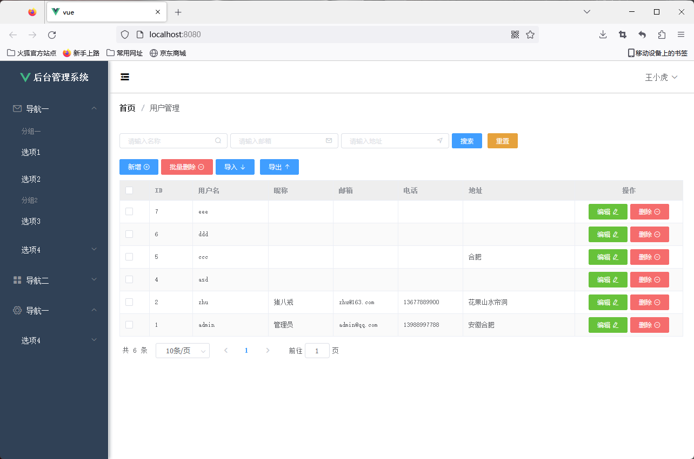

# Vue_study_notes

Vue 学习笔记，分别使用Springboot 和 go 搭建数据库后端。

## Springboot

b站课程《从0开始带你手撸一套SpringBoot+Vue后台管理系统（2022年最新版）》学习笔记。

课程地址：[从0开始带你手撸一套SpringBoot+Vue后台管理系统（2022年最新版）](https://www.bilibili.com/video/BV1U44y1W77D?p=5&vd_source=c2132b75ea9167e7d4b07ff05d7cd9c0)

进度说明：目前完成课程P10之前的内容。

### 前端页面展示

开发所用软件版本：
* Jdk: 1.8
* MySQL: 8.0.32
* node: v16.17.0
* Vue CLI: 4.5.14
* IDEA: 2021.3
* Element UI: 2.15.13
* Navicat: 16.1.8
* postman: 10.10.9

版本：
Spring Boot: 2.7.9

依赖：
* Spring Web / Spring MVC
* MyBatis Framework
* MySQL Driver
* MyBatis-Plus: 3.5.1

前端端口: http://localhost:8080/

后端端口: http://localhost:8081/

### 数据库设计

数据库名称: qing

表: 
* sys_user

### Vue

Vue 前端工程文件所在目录: Springboot/Vue

## go

b站课程 《Go语言 Gin+Vue 前后端分离实战 - OceanLearn》学习笔记。

课程地址：[Go语言 Gin+Vue 前后端分离实战 - OceanLearn](https://www.bilibili.com/video/BV1CE411H7bQ?p=4&vd_source=c2132b75ea9167e7d4b07ff05d7cd9c0)

### 软件版本

* MySQL: 8.0.32
* Navicat: 16.1.8
* postman: 10.10.9
* goland: 2022.3.2
* go: 1.20.1

依赖:
* gin
* gorm
* jwt
* viper

### 数据库设计
数据库名称: ginessential

表:
* users